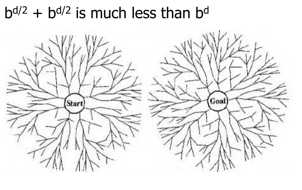

* content
{:toc}

#搜索

##一、形式化一个搜索问题

**良定义的问题和解：**
一个**问题**包含：
1. Agent的初始状态
2. 描述Agent的可能行动，给定一个特殊状态s，ACTION(s)返回在状态s下可以执行的动作集合。
3. 每个动作的描述，正式的名称是转移模型。RESULT(s, a)：在状态s下执行行动a后达到的状态。
4. 目标测试，确定给定的状态是不是目标状态。有时候目标状态是一个显式集合，测试只需要简单检查给定的状态是否在目标状态中。有时候不是一个显式集合，而是具备某些特定抽象属性的状态。
5. 路径耗散函数，为每条路径赋一个耗散值，即加权边。

问题的**解**就是从初始状态到目标状态的一组行动序列。解的质量由路径耗散函数度量，所有解里路径耗散值最小的解即为最优解。

##二、树、图搜索和算法评估

###（1）树搜索

图问题的基本搜索方法
离线模拟状态空间的搜索。
搜索空间模型，而不是真实世界。

###（2）图搜索

###（3）算法评估

1. 完备性：一个搜索算法是完备的，当它在任何存在解的情况下都能找到解。
2. 最优性：一个搜索策略是最优的当有解存在时它总能返回一个最小成本路径。
3. 复杂性：测量算法的执行时间和所需的内存。

##三、盲目（无信息）搜索策略

盲目搜索指的是除了问题定义中提供的状态信息外没有任何附件信息。

	下面所有的搜索算法中衡量复杂度所用的都是搜索一致树，也就是状态空间中每个状态都有b个后继，根节点有b个后继结点为第一层，第一层的b个结点每个结点又有b的后继结点为第二层，以此类推。

###（1）宽度优先搜索
简单搜索策略，先扩展根节点，接着扩展根节点的所有后继，然后再扩展它们的后继，以此类推。

关于完备性、最优性和复杂性：
1. 如果分支因子b是有限的，则算法是完备性。
2. 如果耗散为1，则为最优的。
3. 时间和空间复杂度为

$$\sum_{i=0}^d b^i = O(b^d)$$

	宽度优先搜索得到的是深度最浅的解，不一定是耗散最小的。

###（2）一致代价搜索
扩展的是路径消耗最小的节点n，可以通过将边缘结点集组织成按g值排序的队列来实现。

关于完备性、最优性和复杂性：
	1. 一致代价搜索是最优的。
	2. 如果每一步的代价都大于等于某个小的正值常数e，则一致代价搜索是完备的（如果有0代价行动可能会陷入死循环，例如程序指令的NoOp行动）。
	3. 时间和空间复杂度是
$$O(b^{1+[c*/e]})$$

	宽度优先搜索所需的内存空间太大，我们需要对空间复杂度进行降低。

###（3）深度优先搜索
总是扩展搜索树的当前边缘结点集中最深的结点。搜索过程如下：

关于完备性、最优性和复杂性：

	
	上图中提到可以会导致一个无限深的搜索树，这样搜索任务会完不成。如何解决这个无限深的搜索树。

###（4）深度受限搜索

通过对深度优先搜索设置界限l来避免。就是说深度为l的结点被当做没有后继来对待。解决了无穷路径的问题。

关于完备性、最优性和复杂性：
1. 这个算法是不完备的。
2. 这个算法不是最优的。
3. 时间复杂度为：
$$O(b^L)$$
空间复杂度为：
$$O(bL)$$

	深度受限搜索具有较低的空间复杂度，不一定能找到最浅的解。广度优先搜索具有较高的空间复杂度，其目的是寻找最浅的解。
	低空间复杂度+最浅的解决方案，可能吗？

###（5）迭代加深的深度优先搜索（IDS）

和深度优先搜索结合使用来确定最好的深度界限。做法是不断增大深度限制，首先是0，然后1，然后2，以此类推直到找到目标。

关于完备性、最优性和复杂性：
1. 如果分支因子是有限的，则该算法是完备的。
2. 如果路径代价是节点深度的非递减函数（不随着节点深度的增加而减小），则为最优。
3. 空间复杂度：
$$O(bd)$$

关于一共要生成的结点数目：

$$N_{IDS}=(d+1)1+db+(d-1)b^2+{...}+1b^d=O(b^d)$$

	一般情况下，当搜索空间较大且解的深度未知时，迭代深化是首选的无信息搜索方法。

###（6）双向搜索

同时运行两个搜索，一个从初始状态向前搜索同时另一个从目标状态向后搜索，希望它们在中间点相遇，然后搜索停止，类似一种二分的思想。

时间复杂度和空间复杂度均为：

$$O(b^{d/2})$$
