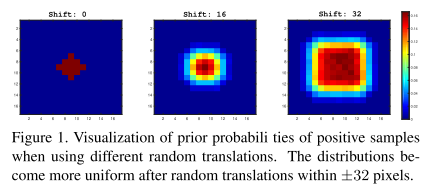
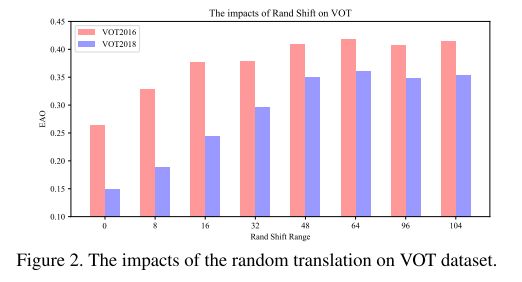
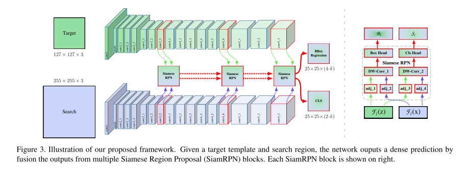

* content
{:toc}

# SiamRPN++

## 1. Introduction

目前所有基于Siamese网络而做的跟踪网络backbone都使用的**8层的AlexNet**，这个浅层的网络肯定会在提取特征的能力上有所欠缺。也有研究人员做实验尝试使用深度的**ResNet**去替换Alex，但是发现性能并没有提升。而本文所做的工作就是进行一系列的改进，使得ResNet成功的在SiamRPN跟踪框架中work。

1. 文中提出了对运用深度网络后反而性能会下降的问题的分析，得出了深层网络会**破坏严格平移不变性**。
2. 文中提出了一种简单有效的采样策略去打破Siamese跟踪器的**空间不变性约束**，从而使得ResNet架构在Siamese跟踪器中work。
3. 对互相关操作提出了一种**逐层特征增强**的架构，通过使用多层特征去得到相似度图。
4. 通过分析Siamese网络结构，文中发现两个网络分支的参数数量是高度不均衡的，所以文中提出了一种**深度可分网络结构**，不仅可以减少模板分支的参数数量，还可以使整个模型的训练过程更加稳定。增强互相关性，生成与不同语义相关联的多组相似映射。

通过改进后，SiamRPN++在OTB2015、VOT2018、UAV123、LaSOT和TrackingNet五个数据集上达到了精确度最优，并且在作者的实验环境上跑到了35fps。作者还使用了稍微浅层的**MobileNet**作为backbone去训练，这样提升了跟踪速度，可以达到70fps，并且跟踪精度也十分可观。

## 2. Related work

目前最先进的跟踪算法就是相关滤波和深度学习的方法。相关滤波是从信号学的基础上发展来的，将跟踪问题看成一个在频率域上做模板匹配的互相关操作的过程，不仅精度高而且速度快。随着深度学习的发展，使用了深度特征的相关滤波算法逐渐成为了最先进的跟踪算法。

目前最近的是用Siamese网络来做跟踪，目前最先进的Siamese跟踪器使用RPN网络来提升性能同时加速跟踪，但是在OTB数据集上，性能还是和ECO、MDNet这些最先进的跟踪器存在差距。

在Siamese跟踪中都是使用AlexNet和VGG中的某些层，做浅层的特征提取跟踪，这种现象可以解释成浅层特征更适合于做跟踪。在本文中作者证明了使用深层网络可以更好的改善整个Siamese网络的性能。

## 3. Siamese Tracking with very deep networks

### 3.1 分析Siamese跟踪网络

基于Siamese网络的跟踪算法把跟踪问题视为一个互相关问题，从一个Siamese网络架构中学习深度模型，然后去进行相似特征图映射。两个分支中一个分支学习目标的特征表示，另一个分支学习搜索空间的表示。目标首先在第一帧中给出，表示为$z$，网络目的是在语义集成空间$\phi(\bullet)$中，从剩下的帧$x$里找到与模板最相似的图像patch：
$$f(z,x)=\phi(z)*\phi(x)+b$$

其中$b$对相似值的偏移量进行建模。

上述的Siamese跟踪器的算法很自然地表现出了两个跟踪器设计中的内在限制：

- 相似度匹配和特征提取都有一个**严格平移不变性**的内在限制$f(z,x[\vartriangle\tau_j])=f(z,x)[\vartriangle\tau_j]$，其中$[\triangle\tau_j]$是平移移位子窗口操作符，这个严格平移不变性保证了高效的跟踪和推理。
- 相似度匹配有一个**结构对称**的限制，举例来说就是$f(z,x')=f(x',z)$，以结构对称的方式设计网络非常适合于相似性学习。

上面的两个限制是影响深度网络用于Siamese跟踪器的主要原因。进一步讲，一个原因是使用深度网络会**破坏网络的严格平移不变性**，另一个原因是**使用RPN网络进行回归和分类需要不对称的特征**。对于第一个问题文中的解决办法是设计空间感知采样策略，第二个问题在3.4节中讨论。

严格平移不变性只存在于没有padding的网络中，也就是一些浅层网络，比如SiamRPN使用的修改过的AlexNet。但是padding在深层网络中是必须存在的，只有padding存在，网络才能做深而不会使特征完全丢失，但这样就会破坏Siamese跟踪网络中的严格平移不变性的限制。文中对于这个限制的假设是：**打破这个限制会带来空间偏差**。

所以对于上述限制，文中做了仿真实验，将带padding的深层网络作为Siamese跟踪器的backbone，定义shift（漂移）是一种数据增强方法，在均匀的分布中对样本进行平移的最大平移范围。然后进行了这样的实验：在三个分开进行的实验环境中，目标都位于图像中心，分别有三个漂移值（0,16,32）。然后使用这些数据分别网络直到收敛后，观察在测试集上的测试结果热力图，如下图所示：

左图的shift值为0,可以看出在边界区域上的目标置信度几乎为0，即网络学习到了一个很强的中心偏移，而忽略了测试目标的表征特征；另外两张图都是带shift的，可以看出通过增加shift的范围可以防止模型陷入到这种中心化的解中。这个实验结果表明：使用shift范围为32的热力图结果更接近测试数据物体的位置分布。这样就证明了使用这种基于空间感知的采样策略可以有效的减轻因为使用了带padding的深层网络破坏了严格平移不变性限制所带来的不好的跟踪效果。

文中为了避免这种在目标物体上的中心偏移，使用了空间感知采样策略对backbone为ResNet50的SiamRPN进行了训练。下图为训练的表现结果：

在$shift=0$的时候，网络在VOT2018上只有0.14的得分，随着shift的增加，网络的性能在不断变好，到大约$shift=64$的时候变得最好，这样也验证了采用中加入shift的重要性。

### 3.2 ResNet驱动的Siamese跟踪

在3.2小节中消除了中心偏移所带来的影响，这样就使得所有现成的网络（MoblieNet，ResNet等）都可以用到跟踪中来，并且我们可以自己去修改建立网络拓扑。在这一小节中主要讨论了**如果将一个深层网络应用到SiamRPN的跟踪算法中**，主要关注的还是ResNet50。常规的ResNet中存在32个像素的大stride，这样大的步长对于紧密的Siamese网络预测非常不适用。下图是文中设计的ResNet SiamRPN网络结构：

作者将$conv4$和$conv5$（即ResNet50的最后两个block）的步长由16和32全部设置成8，这样做一是使得最后两个block具有单位空间步长，二是通过扩张卷积来增加感受野。同时在每个block的输出位置加一个额外的$1\times1$的卷积层，用来将通道数降低到256。

因为所有层的padding都保留了，所以模板特征的空间大小增加到了15，这会给相关性计算模块带来沉重的计算负担。因此我们裁剪中间的$7\times7$的区域作为模板特征，其中每个特征单元仍然可以捕获整个目标区域（这里减小了计算负担，相当于做了一个加速的步骤）。